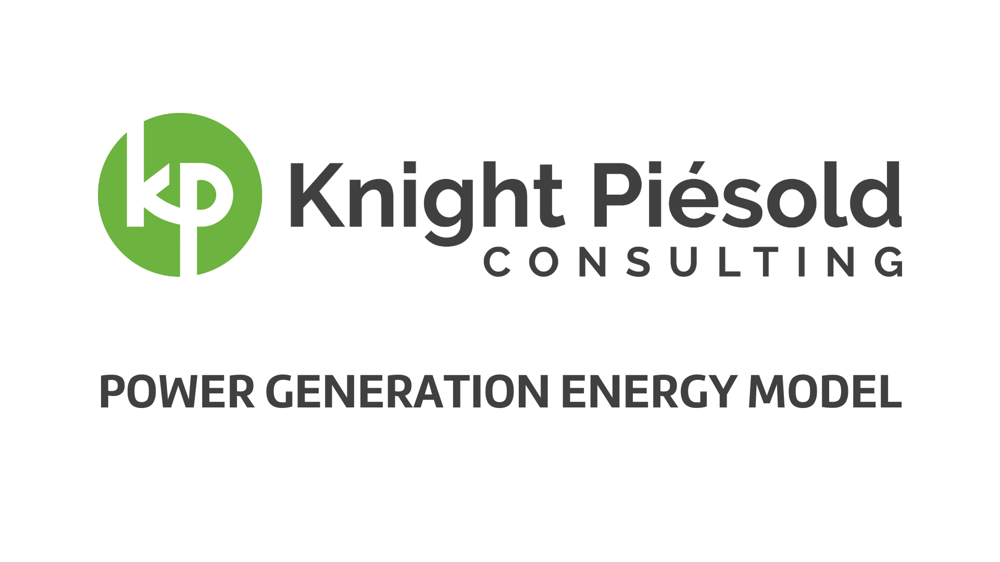

## Bridge River HEP Energy Modeling Tool




## Overview

The Bridge River HEP Energy Modeling Tool is an interactive dashboard that helps optimize energy generation and revenue forecasting for the proposed Bridge River Hydropower Scheme in South Central BC. This tool uses historical hydrological data, variable energy pricing, and operational parameters to provide insights into the most efficient generation strategies.

### Features

* **Flow and Demand Forecasting:** Leverages machine learning to predict water flow and energy demand using historical data.
* **Operational Strategy Optimization:** Uses optimization algorithms to suggest the ideal times for energy production, factoring in energy prices, water availability, and environmental constraints.
* **Maintenance Scheduling:** Includes predictive maintenance models to anticipate equipment servicing needs, reducing downtime and operational costs.
* **Environmental Impact Assessment:** Provides insights into the environmental effects associated with different operational strategies, promoting sustainable decision-making.
* **Interactive Data Visualization:** Features dynamic charts and graphs to clearly represent energy production, revenue forecasts, and environmental impacts.

## Getting Started

### Prerequisites

* Python 3.8 or newer
* Poetry for dependency management

### Installation

Install with Poetry
```
poetry install
```
### Running the Dashboard

Activate the Poetry shell
```
poetry shell
```
Run the Dashboard
```
solara run my_dashboard.py
```
### Access the Dashboard:

Open your browser and go to **http://localhost:8765** (or **http://localhost:4000** if running in a Docker container).

### Usage

Use the input fields to adjust Dam Crest Elevation, Design Flow, Penstock Diameter, and Energy Price.
Select desired Power Production Months.
The dashboard will dynamically update calculations, including optimal revenue generation scenarios and environmental impact assessments.
Contributing

We welcome contributions! See our Contributing Guide for instructions on submitting pull requests, reporting bugs, or suggesting new features.

License

MIT License (see LICENSE file).

Acknowledgments

Solara for providing the framework for the interactive dashboard.
Plotly for advanced data visualization capabilities.

### Commercial License Agreement

This software and its documentation are proprietary software of Knight Piesold Ltd. and are protected by copyright laws and international copyright treaties, as well as other intellectual property laws and treaties.

Copyright © 2024 Knight Piesold Ltd. All rights reserved.

Created by James O'Reilly, P.Eng.

License Grant: Knight Piesold Ltd. hereby grants you a non-exclusive, non-transferable, worldwide right to use this software, solely for your own internal business purposes, subject to the terms and conditions of this Agreement. All rights not expressly granted to you are reserved by Knight Piesold Ltd.

Restrictions: You may not modify, distribute, sell, or lease this software or its documentation. You may not use the software to provide time-sharing services, hosting services, or as part of a service bureau. You may not reverse engineer, decompile, or disassemble the software.

By using this software, you acknowledge that you have read this agreement, understand it, and agree to be bound by its terms and conditions.

For inquiries, please contact [joreilly@kightpiesold.com].
